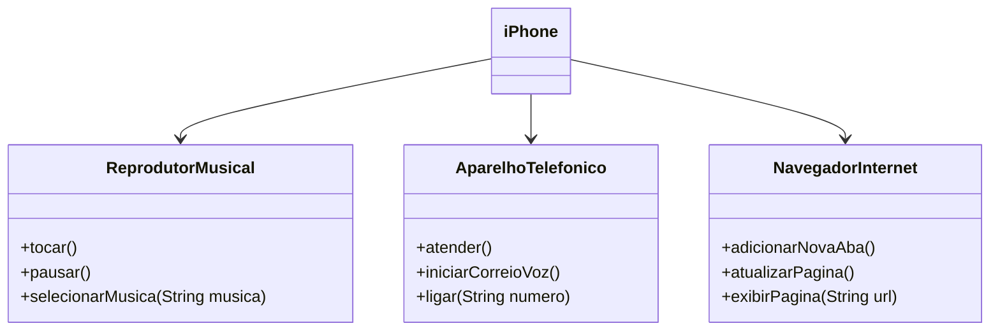

# Projeto-iphone

 

```mermaid


classDiagram
    class ReprodutorMusical {
        +tocar()
        +pausar()
        +selecionarMusica(String musica)
    }

    class AparelhoTelefonico {
        +atender()
        +iniciarCorreioVoz()
        +ligar(String numero)
    }

    class NavegadorInternet {
        +adicionarNovaAba()
        +atualizarPagina()
        +exibirPagina(String url)
    }

    class iPhone {
    }

    iPhone --> ReprodutorMusical
    iPhone --> AparelhoTelefonico
    iPhone --> NavegadorInternet


``` 
